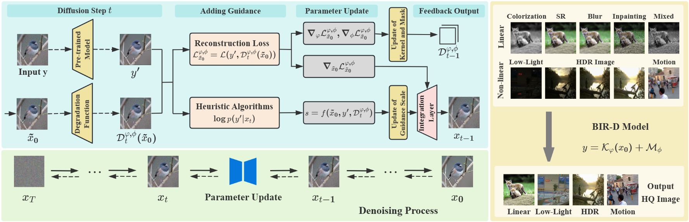
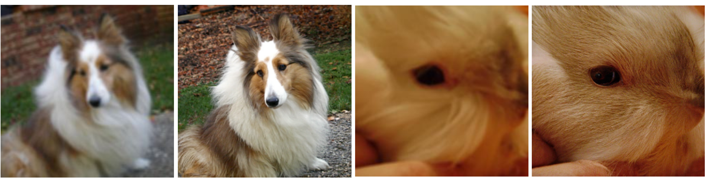
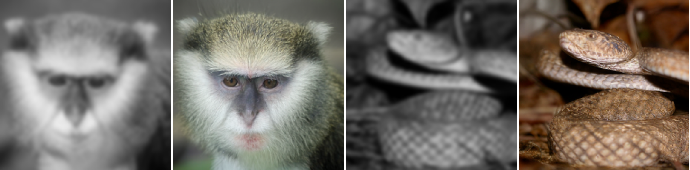
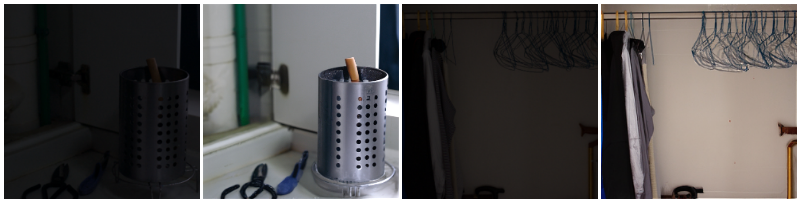

<div align="center">

<h1>BIR-D: Taming Generative Diffusion Prior for Universal Blind Image Restoration</h1>

In this study, we aim to use a DDPM to learn the prior distribution of images and ultimately solve non-blind and blind problems in various image restoration tasks.

<div>
    <a target='_blank'>Siwei Tu</a><sup>1</sup>&emsp;
    <a target='_blank'>Weidong Yang</a><sup>1,†</sup>&emsp;
    <a target='_blank'>Ben Fei</a><sup>2,†</sup>&emsp;
</div>

<div>
    <sup>1</sup>Fudan University&emsp; 
    <sup>2</sup>Chinese University of Hong Kong&emsp; 
</div>




---

</div>


## :diamonds: Checkpoints and Dataset
- Our model utilizes pretrained DDPMs on ImageNet.
[https://github.com/openai/guided-diffusion](https://github.com/openai/guided-diffusion/tree/main)

- Datasets can be download in [https://paperswithcode.com/](https://paperswithcode.com/).

For real-world datasets, it is necessary to add degradation in advance and form a .npz file.

## Tasks

### :fire:Blind Image Restoration

```
MODEL_FLAGS="--attention_resolutions 32,16,8 --class_cond False --diffusion_steps 1000 --image_size 256 --learn_sigma True --noise_schedule linear --num_channels 256 --num_head_channels 64 --num_res_blocks 2 --resblock_updown True --use_fp16 True --use_scale_shift_norm True"
```
```
python deblurring.py \
$MODEL_FLAGS \
--save_dir [Path of storing output results]
--base_samples [Path of the npz file corresponding to the downloaded Imagenet dataset]
```




### :fire:Blind Face Restoration / Motion Blur Reduction

```
MODEL_FLAGS="--attention_resolutions 32,16,8 --class_cond False --diffusion_steps 1000 --image_size 256 --learn_sigma True --noise_schedule linear --num_channels 256 --num_head_channels 64 --num_res_blocks 2 --resblock_updown True --use_fp16 True --use_scale_shift_norm True"
```

```
python blind_image_restoration.py \
$MODEL_FLAGS \
--save_dir [Path of storing output results]
--base_samples [Path of the blind image restoration dataset]
```


### :fire:Multi-Degradation Image Restoration

```
MODEL_FLAGS="--attention_resolutions 32,16,8 --class_cond False --diffusion_steps 1000 --image_size 256 --learn_sigma True --noise_schedule linear --num_channels 256 --num_head_channels 64 --num_res_blocks 2 --resblock_updown True --use_fp16 True --use_scale_shift_norm True"
```

```
python multi_restoration.py \
$MODEL_FLAGS \
--save_dir [Path of storing output results]
--base_samples [Path of the multi-degradation dataset]
```




### :fire:Low-light Enhancement

```
MODEL_FLAGS="--attention_resolutions 32,16,8 --class_cond False --diffusion_steps 1000 --image_size 256 --learn_sigma True --noise_schedule linear --num_channels 256 --num_head_channels 64 --num_res_blocks 2 --resblock_updown True --use_fp16 True --use_scale_shift_norm True"
```

```
python lowlight.py \
$MODEL_FLAGS \
--save_dir [Path of storing output results]
--base_samples [Path of the low-light enhancement dataset]
```





## :clap: Acknowledgement

The authors would like to thank Zhaoyang Lyu for his technical assistance. This work was supported
by the National Natural Science Foundation of China (U2033209)

Our paper is inspired by:
- [https://generativediffusionprior.github.io/](https://generativediffusionprior.github.io/)(the GDP repo)
- [https://0x3f3f3f3fun.github.io/projects/diffbir/](https://0x3f3f3f3fun.github.io/projects/diffbir/)(the DiffBIR repo)

Thanks for their awesome works!


